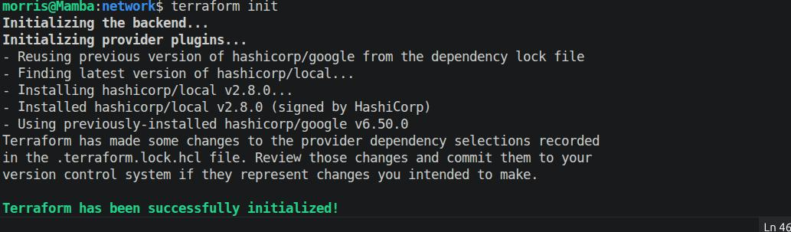
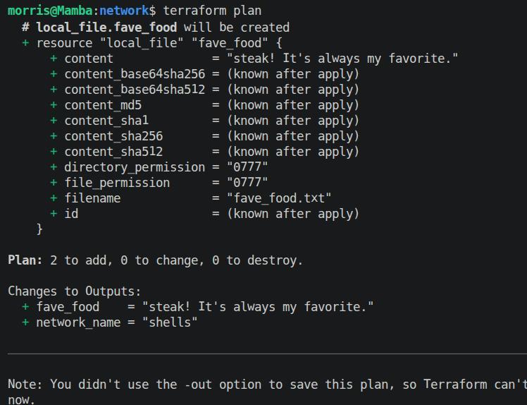
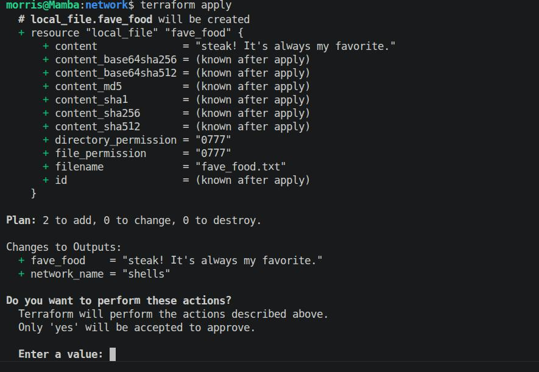
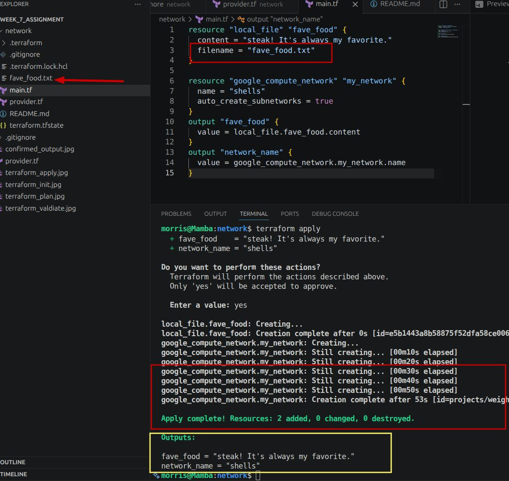

# Week 7 Assignment

## Requirements

>> Code in a new GitHub repo
> GenAI cannot be used for everything
> A README explaining how you did this, documentation used, resources used, issues encountered and so on
>>
>> - Spelling, grammar, and formatting is not super important so don’t use AI for this
>> - If you must run it through AI then you need to include the “pre-AI” version too
>
>A screenshot of a successful deployment of terraform showing the output and file created
>
> In one folder called “infra” or “terraform” or similar containing terraform code accomplishing this:
>>
>> - A provider terraform configuration file with the latest version of the Google provider
>
>> - A remote backend is not needed; use a gitignore (ask your group leader if unsure on this please)
>
>> - A GCP VPC terraform configuration file using example code from the Terraform registry
>
>> - A text file made by terraform from the local_file resource with your favorite food in it
>
>>- Output block of your VPC’s name in GCP using terraform

---

### Steps

1. Create a folder to contain all the relevant and necessary files to run terraform code.
2. Open that folder in VS Code.
3. Create a main.tf file
4. Add a resource block for the resource being created. In this case it is a local file, so we need to use the local_file resource
5. Give the resource a name.
6. Provide the necessary arguments/attributes for the resource.
    - filename = "Name of File"
    - Content  = "contents to include in the file"

7. Save the file.
8. Complete steps 1-7 for the next resource you want to create (google_compute_network)
9. Open a terminal in your working folder and initialize terraform by running ```terraform init```

10. Confirm that your terraform syntax is correct by running ```terraform validate```

11. Confirm your code by running ```terraform plan`` and verify that your code is producing exactly what you intend.

12. Run ```terraform apply``` and confirm with "yes" at the prompt to deploy your resource.

13. After the code runs, you should see a new file, with the specs you declared in your code, created inside the folder

